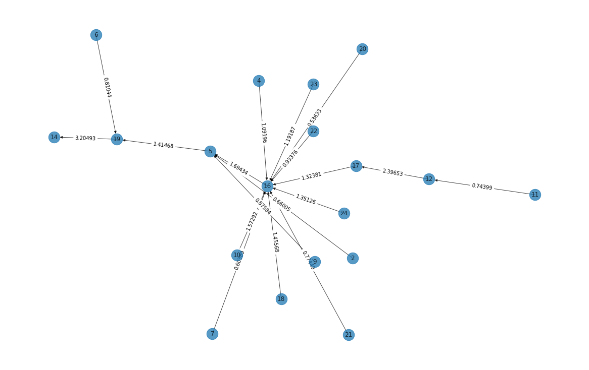

# DAG Object

Format
------
keys: (vertice, vertice).  
      Each vertice corresponds to a store.

values: edges.  
        Each edge corresponds to the sell-out ratio between the POSs shared
        SKUs with the second POS (vertice) as the denominator.

Example
-------
(11, 12): 0.74399,  
(12, 17): 2.39653,  
(17, 16): 1.32381,  
(10, 16): 1.57292,  
(23, 16): 1.19187,  
(18, 16): 1.45568,  
(24, 16): 1.35126,  
(22, 16): 0.93376,  
(4, 16): 1.09196,  
(7, 16): 0.60389,  
(21, 16): 0.77449,  
(20, 16): 0.53633,  
(16, 5): 1.69434,  
(9, 5): 0.87584,  
(2, 5): 0.66005,  
(5, 19): 1.41468,  
(6, 19): 0.81044,  
(19, 14): 3.20493


In the pair (11, 12) the sell-out of the shared SKUs between vertices 11 and 12 is, in average, for vertice 11,
0.74399 times the sell-out of vertice 12.

DAG constructed in a greedy way:


DAG referenced to sink vertice:


DAG redirected to another vertice:


# Usage Example 

```python
from src.graph_utils.reducers import multiplication_reductor
from src.graph_utils.plotters import plot_dag, plot_two_dimensional_dag
from src.graph_utils.utils import rename_verticies, rename_edges,redirect_dag_to_new_sink, normalize_dag_edges 


df = pd.DataFrame(np.random.normal(loc=60, scale=15, size=(100, 15)))
df = df.mask(np.random.random(df.shape) < .6)
arr = df.T.values

dag = create_size_relationships_dag(arr)
options_dag = code_utils.get_number_of_intersections(arr)
options_dag_normalized = normalize_dag_edges(options_dag, offset=1, scaling_factor=6)
plot_two_dimensional_dag(dag, options_dag_normalized)
    
minimal_dag = multiplication_reductor(dag)
plot_dag(minimal_dag)

redirected_minimal_dag = multiplication_reductor(redirect_dag_to_new_sink(dag, 10))
plot_dag(redirected_minimal_dag)
 ```

 DAG constructed in a greedy way:


DAG referenced to sink vertice:


DAG redirected to another vertice:

